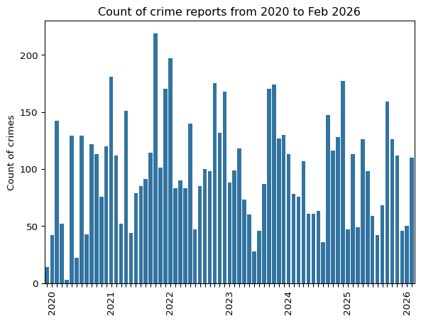
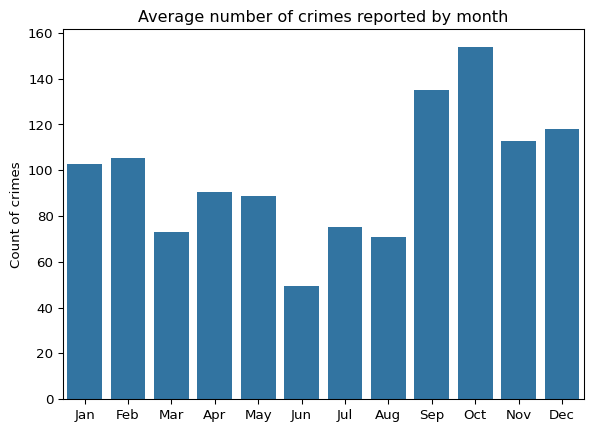
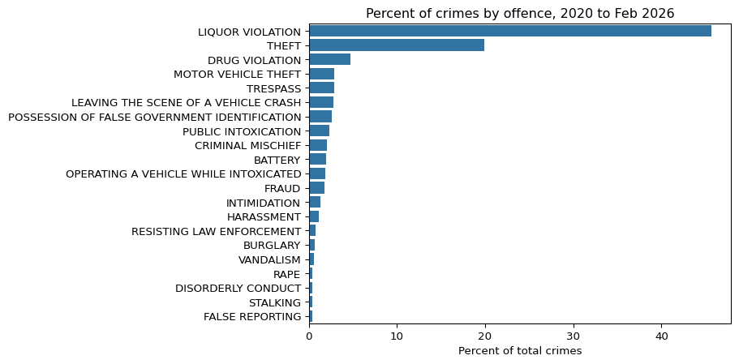
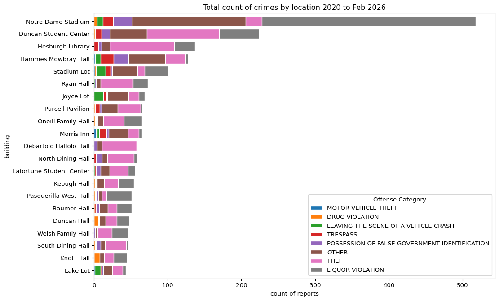
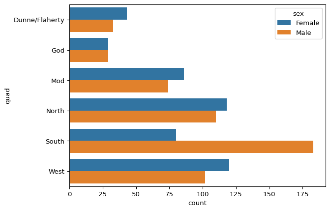
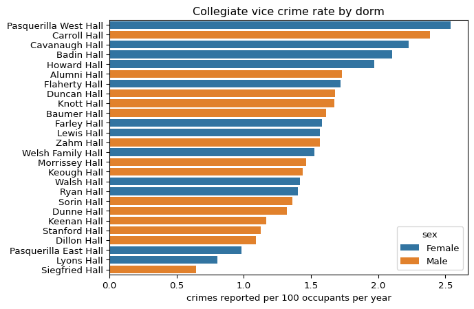

# Campus Dorm & Crime Analysis
Joe Brady

## Introduction

This project will be a two part excercise. First, I will scrape the
Notre Dame dorm pages to pull dorm stats, descriptions, rectors, and
rector bios. Then, I will do a topic analysis to see if I can group
dorms and/or rectors based on text topic analysis (BERT).

For part two, I will do analysis on a only semi-structured dataset:
Notre Dame Police Department (NDPD) crime blotters that are released
daily as a PDF, from 2020 to present (Feb 2026). These files are stored
in Google Drive, so for ease of use I read all the PDFs for the daily
reports and combined them into one csv via a google colab script. The
csv loaded in to this code page is the output of that script.

For the crime data, I will answer (1) if there are any growth/decline in
campus crime, (2) if there is seasonality to crime, (3) what type of
crime is committed, (4) where does it occur on campus, and (5) what
dorms have the highest rate of ‘college vice’ crimes, i.e. drinking,
fake IDs, drugs, and public intoxication.

### Load Packages

``` python
from bs4 import BeautifulSoup
import pandas as pd
import re
import random
import time
import requests
import numpy as np
from thefuzz import process, fuzz
from bertopic import BERTopic
from bertopic.vectorizers import ClassTfidfTransformer
from joblib import load, dump
```

## Web scraping: dorm / rector info

### Step 1: get all the links to dorm web pages

This first code chunk does the first request for the pages that have the
links we will need for scraping. The first one is mens dorms, the second
women dorms.

``` python
#mens dorm links requeset
m_link = 'https://residentiallife.nd.edu/undergraduate/residence-halls/mens-halls/'
m_request = requests.get(m_link)
m_soup = BeautifulSoup(m_request.content, features="lxml")

time.sleep(1.1)

#womens dorm links request
w_link = 'https://residentiallife.nd.edu/undergraduate/residence-halls/womens-halls/'
w_request = requests.get(w_link)
w_soup = BeautifulSoup(w_request.content, features="lxml")
```

This code chunk finds all the links to dorm description pages, which we
will use in subsequent scraping

``` python
#mens links
step1_m = m_soup.select('[class = "columns medium-6 large-4"] a')
men_links = [a.get('href') for a in step1_m]

#womens links
step1_w = w_soup.select('[class = "columns medium-6 large-4"] a')
women_links = [a.get('href') for a in step1_w]

#correct_format
men_links = ['https://residentiallife.nd.edu' + link for link in men_links]
women_links = ['https://residentiallife.nd.edu' + link for link in women_links]

#combine
dorm_links = men_links + women_links
```

### Step 2: Harvest data from links

This loop iterates through the found links from above and scrapes for
description, dorm stats such as quad location, capacity, and gender, and
rectors & their biographies.

``` python
#initialize_data
data_store = []

#loop to get data
for link in dorm_links:
    #request
    req = requests.get(link)
    soup = BeautifulSoup(req.content, features = 'lxml')

    #name of dorm
    name = soup.select('.page-title')[0].text

    #dorm description
    temp = soup.select_one('.page-title').find_next_siblings('p')
    description = ''
    for p in temp:
        description = description + ' ' + p.text
    description = description.strip()

    #rector name and bio
    rector = soup.select('.profile-item-name')[0].text
    rector_bio = soup.select('.profile-item-bio')[0].text

    #hall stats
    parents = soup.select_one('[class="section-title color-orange"]+.card-section')
    labels = [a.text.lower().replace(' ', '_') for a in parents.find_all('dt')]
    data = [a.text for a in parents.find_all('dd')]

    #start row dictionary
    row = {
        'name': name,
        'description': description,
        'rector': rector,
        'rector_bio': rector_bio
    }

    #put other stats together in row
    row = row | dict(zip(labels, data))

    #append data
    data_store.append(row)

    #sleep pause
    time.sleep(1 +random.randint(0, 10)/100)
```

This fixes two dorms that don’t have a quad.

``` python
dorm_df = pd.DataFrame(data_store)
dorm_df.loc[dorm_df['quad']=='', 'quad'] = "Dunne/Flaherty"
dorm_df.head()
```

<div>
<style scoped>
    .dataframe tbody tr th:only-of-type {
        vertical-align: middle;
    }
&#10;    .dataframe tbody tr th {
        vertical-align: top;
    }
&#10;    .dataframe thead th {
        text-align: right;
    }
</style>

|  | name | description | rector | rector_bio | approximate_capacity | number_of_sections | year_established | quad | sex | chapel | number_of_floors | number_of_rooms | elevator | air_conditioning | nickname/mascot |
|----|----|----|----|----|----|----|----|----|----|----|----|----|----|----|----|
| 0 | Alumni Hall | Constructed in 1931, Alumni Hall originally se... | Br. Dennis Gunn, CFC | Br. Dennis serves in the Philip J. and Kathryn... | 225 | 6 | 1931 | South | Male | St. Charles Borromeo | 3 | 92 | Yes | No | Dawgs |
| 1 | Baumer Hall | Baumer Hall is one of the newest men's hall in... | Dcn. T.J. Groden, C.S.C. | Like Pope Leo XIV, T.J. Groden, C.S.C., was bo... | 251 | 6 | 2019 | South | Male | St. Martin de Porres | 4 |  | Yes | Yes | The Buccaneers |
| 2 | Carroll Hall | Built in 1906 as the scholasticate (house of s... | Br. Jacob Gorman, C.S.C. | Born and raised in Evansville, Indiana, Br. Ja... | 102 | 4 | 1906 | South | Male | St. Andre Bessette | 4 | 47 | No | No | Vermin |
| 3 | Coyle Community in Zahm Hall | Built in 1937, Zahm Hall is named in honor of ... | Joey Quinones | Joey Quinones is a Southern California (San Di... | 176 | 7 | 1937 | North | Male | St. Albert the Great | 4 | 98 | Yes | No | Otters |
| 4 | Dillon Hall | Constructed in 1931 in honor of the second pre... | Rev. Ed Dolphin, C.S.C. | Fr. Ed Dolphin, CSC grew up in the lovely conf... | 253 | 9 | 1931 | South | Male | St. Patrick | 3 | 132 | No | No | Big Red |

</div>

### Topic Analysis

Next, we do topic analysis for both the dorm description and the rector
biography. We use BERT, which usually doesn’t function super well
without a lot of data. However, I like BERT because of its grouping
system and the fact that it outputs the representative document for the
topic group. Moreover, if we remove stopwords first, BERT does better
(for small datasets; BERT usually likes to use stopwords to analyze
context)

This code chunk loads in our open source stopwords list and creates
cleaned text without these stopwords

``` python
topic_df = dorm_df.copy()

#get stopwords list
stopwords = requests.get('https://raw.githubusercontent.com/stopwords-iso/stopwords-en/refs/heads/master/stopwords-en.txt')
stopwords = stopwords.text.split('\n')

#remove stopwords from text
stopword_pattern = r'\b(?:{})\b'.format('|'.join(stopwords))
topic_df['description_clean'] = topic_df['description'].str.replace(stopword_pattern, '', regex=True)
topic_df['rector_bio_clean'] = topic_df['rector_bio'].str.replace(stopword_pattern, '', regex=True)
```

This code chunk sets up the BERT model and transformer used, and then
fits the model to the two datasets - dorm descriptions and rector
biographies. We then save the model and fit data into a file so we don’t
have to go through the training process every time we want to analyze
the fit data topics. (For this small a set it really doesn’t matter as
fitting the model takes seconds, but this is good practice.)

``` python
#define transformer
ctfidf_model = ClassTfidfTransformer(
  reduce_frequent_words=True
)

#define model
topic_model_desc = BERTopic(ctfidf_model=ctfidf_model)
topic_model_bio = BERTopic(ctfidf_model=ctfidf_model)

#fit transform model
desc_topics, desc_probs = topic_model_desc.fit_transform(topic_df['description_clean'].to_list())
bio_topics, bio_probs = topic_model_bio.fit_transform(topic_df['rector_bio_clean'].to_list())

#dump file into file in my folder
dump(
  [topic_model_desc, desc_topics, desc_probs], 
  "topic_model_desc.joblib" #saves to current working folder
)

dump(
  [topic_model_bio, bio_topics, bio_probs], 
  "topic_model_bio.joblib" #saves to current working folder
)
```

    ['topic_model_bio.joblib']

\#Next, we load the model and results back in and look at the results.

``` python
topic_model_desc, desc_topics, desc_probs = load(
  'topic_model_desc.joblib'
)

topic_model_bio, bio_topics, bio_probs = load(
  'topic_model_bio.joblib'
)

#print topics table
display(topic_model_desc.get_topic_info())
display(topic_model_bio.get_topic_info())

model_bio_df = topic_model_bio.get_topic_info()

topic_df['bio_topic'] = topic_model_bio.get_document_info(topic_df['rector_bio_clean'])['Topic']
for topic in topic_df['bio_topic'].unique().tolist():
    print(f"Topic ({topic}):")
    display(topic_df.loc[topic_df['bio_topic']==topic, ['name', 'rector', 'rector_bio']])
    print(model_bio_df.loc[model_bio_df['Topic']==topic, 'Representative_Docs'])
    print('\n')
```

<div>
<style scoped>
    .dataframe tbody tr th:only-of-type {
        vertical-align: middle;
    }
&#10;    .dataframe tbody tr th {
        vertical-align: top;
    }
&#10;    .dataframe thead th {
        text-align: right;
    }
</style>

|  | Topic | Count | Name | Representation | Representative_Docs |
|----|----|----|----|----|----|
| 0 | -1 | 32 | -1_hall_residence_the_dame | \[hall, residence, the, dame, notre, named, wom... | \[Welsh Family Hall built 1997 named honor... |

</div>

<div>
<style scoped>
    .dataframe tbody tr th:only-of-type {
        vertical-align: middle;
    }
&#10;    .dataframe tbody tr th {
        vertical-align: top;
    }
&#10;    .dataframe thead th {
        text-align: right;
    }
</style>

|  | Topic | Count | Name | Representation | Representative_Docs |
|----|----|----|----|----|----|
| 0 | -1 | 3 | -1_nic_ireland_michael_sports | \[nic, ireland, michael, sports, ursinus, subur... | \[Ireland Majewski Michigan native earned b... |
| 1 | 0 | 15 | 0_she_university_time_ministry | \[she, university, time, ministry, karla, arts,... | \[Karla born Nicaragua raised beautiful su... |
| 2 | 1 | 14 | 1_fr_he_holy_cross | \[fr, he, holy, cross, notre, dame, congregatio... | \[Daniel Driscoll serves Rev. Edward A. Monk ... |

</div>

    Topic (1):

<div>
<style scoped>
    .dataframe tbody tr th:only-of-type {
        vertical-align: middle;
    }
&#10;    .dataframe tbody tr th {
        vertical-align: top;
    }
&#10;    .dataframe thead th {
        text-align: right;
    }
</style>

|  | name | rector | rector_bio |
|----|----|----|----|
| 0 | Alumni Hall | Br. Dennis Gunn, CFC | Br. Dennis serves in the Philip J. and Kathryn... |
| 1 | Baumer Hall | Dcn. T.J. Groden, C.S.C. | Like Pope Leo XIV, T.J. Groden, C.S.C., was bo... |
| 2 | Carroll Hall | Br. Jacob Gorman, C.S.C. | Born and raised in Evansville, Indiana, Br. Ja... |
| 3 | Coyle Community in Zahm Hall | Joey Quinones | Joey Quinones is a Southern California (San Di... |
| 4 | Dillon Hall | Rev. Ed Dolphin, C.S.C. | Fr. Ed Dolphin, CSC grew up in the lovely conf... |
| 6 | Dunne Hall | Rev. Eric Schimmel, C.S.C. | Fr. Eric Schimmel, C.S.C., serves in the Coyne... |
| 7 | Graham Family Hall | Rev. Bill Dailey, C.S.C. | Fr. Bill Dailey, CSC, returned in 2020 to the ... |
| 9 | Keough Hall | Rev. David Murray, C.S.C. | David Murray, C.S.C., was born in central Illi... |
| 10 | Knott Hall | Rev. Jim King C.S.C. | Fr. Jim King, C.S.C currently serves as the Re... |
| 11 | Morrissey Hall | David Diamond | David Diamond is a retired US Army Special For... |
| 12 | O'Neill Family Hall | Rev. Mike Ryan, C.S.C. | Fr. Mike Ryan, C.S.C. is currently in his seco... |
| 14 | Sorin Hall | Daniel Driscoll | Daniel Driscoll serves in the Rev. Edward A. M... |
| 15 | Stanford Hall | Rev. Chris Brennan, C.S.C. | Fr. Chris Brennan, C.S.C., is a proud South Be... |
| 16 | St. Edward's Hall | Rev. Ralph Haag, C.S.C. | Rev. Ralph Haag, C.S.C., serves in the Matthew... |

</div>

    2    [Daniel Driscoll serves   Rev. Edward A. Monk ...
    Name: Representative_Docs, dtype: object


    Topic (-1):

<div>
<style scoped>
    .dataframe tbody tr th:only-of-type {
        vertical-align: middle;
    }
&#10;    .dataframe tbody tr th {
        vertical-align: top;
    }
&#10;    .dataframe thead th {
        text-align: right;
    }
</style>

|  | name | rector | rector_bio |
|----|----|----|----|
| 5 | Duncan Hall | Nic Schoppe | Nic Schoppe was born and raised in Blue Bell, ... |
| 13 | Siegfried Hall | Michael Davis | Michael calls the south Chicago suburb of New ... |
| 27 | Pasquerilla East Hall | Ireland Majewski | Ireland Majewski is a Michigan native who earn... |

</div>

    0    [Ireland Majewski   Michigan native  earned  b...
    Name: Representative_Docs, dtype: object


    Topic (0):

<div>
<style scoped>
    .dataframe tbody tr th:only-of-type {
        vertical-align: middle;
    }
&#10;    .dataframe tbody tr th {
        vertical-align: top;
    }
&#10;    .dataframe thead th {
        text-align: right;
    }
</style>

|  | name | rector | rector_bio |
|----|----|----|----|
| 8 | Keenan Hall | Cory Hodson | A native of Massachusetts, Cory Hodson is exci... |
| 17 | Badin Hall | Amanda Bell | Amanda Bell is from Chandler, AZ. She graduate... |
| 18 | Breen-Phillips Hall | Sarah Motter | Sarah was born and raised in Columbus, Ohio, b... |
| 19 | Cavanaugh Hall | Marlyn Batista | Originally from the Dominican Republic, Marlyn... |
| 20 | Farley Hall | Maeve Orlowski-Scherer | Maeve Orlowski-Scherer hails from New Brunswic... |
| 21 | Flaherty Hall | Luz Hernandez | Luz Hernandez is honored to serve as a Rector ... |
| 22 | Howard Hall | Anna Kenny | A Michigan native, Anna Kenny earned her Bache... |
| 23 | Johnson Family Hall | Sara Ghyselinck | Sara Ghyselinck is a South Bend native with a ... |
| 24 | Lewis Hall | Megan Moore | Megan grew up in northeast Iowa, but has calle... |
| 25 | Lyons Hall | Karla Diaz | Karla was born in Nicaragua and raised in the ... |
| 26 | McGlinn Hall | Elizabeth Greenop | Elizabeth Greenop attended Xavier University f... |
| 28 | Pasquerilla West Hall | Annie Boyle | Annie received both her bachelor's degree (Pro... |
| 29 | Ryan Hall | Ally Liedtke | Ally Liedtke serves in the Megan K. Crowley En... |
| 30 | Walsh Hall | Cheyenne Joseph | Cheyenne grew up on a farm on the outskirts of... |
| 31 | Welsh Family Hall | Monica Murphy | Born and raised in South Bend, Monica has pers... |

</div>

    1    [Karla  born  Nicaragua  raised   beautiful su...
    Name: Representative_Docs, dtype: object

### Interpretation

Dorm description only has 1 topic, so the texts are pretty uniform.
Nothing interesting to note here unfortunately.

For rector biography, BERT has found three different ‘classes’ of
rectors that Notre Dame employs.

Class 1 are the religious rectors: priests and brothers of the Holy
Cross order. However, there are two exceptions: Joey Quinones of Coyle
Community in Zahm Hall, and Cory Hodson in Keenan Hall. Cory is deeply
religious as well and has a masters in divinity, so that possibly
explains his inclusion. Joey is a mystery however. All of these rectors
are Men’s dorm rectors, and almost all are priests or brothers.

Class -1 are three male dorm rectors that were seperated from the
others. They are two laypeople and one priest. They appear to be united
by an interest in sports and growing up in the suburbs, and are younger.
Rev Mike Ryan is an inexplicable inclusion.

Class 0 are all the Womens dorm rectors. They are not priests or
brothers, and BERT really picked up on the “she” difference in the
biographies.

## Crime Data

Next, we will look at NDPD’s crime data from Jan 1 2020 to present (Feb
2026). As said before, there is a google colab script that pulls in all
the daily PDFs from NDSP’s public google driveand combines them into one
csv file, which we will pull in now

``` python
crime_df = pd.read_csv("crime_2020to2026_all.csv")
crime_df = crime_df.drop(columns = ['Unnamed: 0'])
display(crime_df.head())
crime_df.shape
```

<div>
<style scoped>
    .dataframe tbody tr th:only-of-type {
        vertical-align: middle;
    }
&#10;    .dataframe tbody tr th {
        vertical-align: top;
    }
&#10;    .dataframe thead th {
        text-align: right;
    }
</style>

|  | incident | start_dt | end_dt | reported_dt | offence | address | disposition |
|----|----|----|----|----|----|----|----|
| 0 | 22‐002313 | 12/19/2022 11:53 | 12/28/2022 11:56 | 12/28/2022 11:53 | HARASSMENT | 54140 S R 933; FATIMA; Our Lady of Fatima | Pending |
| 1 | 23‐000007 | 1/4/2023 1:04 | 1/4/2023 1:04 | 1/4/2023 1:04 | MOTOR VEHICLE‐DRIVING WHILE\rSUSPENDED‐ PRIOR | DOUGLAS RD & JUNIPER RD | Arrest |
| 2 | 22‐002271 | 12/12/2022 16:30 | 12/12/2022 22:30 | 12/14/2022 15:55 | THEFT | 19050 MOOSE KRAUSE NORTH; DEBART | HR Review |
| 3 | 22‐002274 | 12/13/2022 13:00 | 12/14/2022 20:00 | 12/15/2022 11:48 | THEFT | 18940 LIBRARY LN; LIBR; Hesburgh Library | HR Review |
| 4 | 23‐000009 | 1/5/2023 13:45 | 1/5/2023 14:51 | 1/5/2023 13:45 | CRIMINAL MISCHIEF | 1 LAKE LOT; LAKEL; Lake Lot | Pending |

</div>

    (7385, 7)

This finds any screwed up rows - any rows with NaN present. The data in
the PDFs is very solid and does not ever have missing data, so any
missing data indicates a screw up with the pdf reader (tabula) used in
the colab script.

``` python
#show how many messed up rows we have. Only 8, so just drop them
print(f"total f'd rows: {crime_df.isna().astype(int).sum(axis=1).sum()}") 

#drop the rows
crime_df = crime_df.loc[~crime_df.isna().astype(int).sum(axis=1).astype(bool)].reset_index(drop=True)
crime_df.shape
```

    total f'd rows: 8

    (7382, 7)

This codde does converts the datetime columns to a datetime format, and
then attempts to extract a building from the listed address. The address
column is very messy, not uniform in format or categories, and contains
copious typos. My guess is that the officer is quickly typing up the
address in the report, and officers differ in their description of
places.

I found a minor pattern - the use of semicolons to highlight an actual
building. However, sometimes the building name is between two semicolons
(202 irish blvd; Dunne Hall; outside sidewalk), but sometimes they are
at the end of the string and seperated by a semicolon (205 irish road;
Keenan Hall). Generally, the longer string is actually the building
name, so we go with that.

``` python
#convert datetime columns to datetime datatype
for col in [col for col in crime_df.columns if '_dt' in col]:
    crime_df[col] = pd.to_datetime(crime_df[col], errors = 'coerce') #coerce non-datetime

#extract building from address
temp= pd.DataFrame([])
temp['middle'] = crime_df['address'].str.extract(r';\s*(.+?)\s*;')
temp['end'] = crime_df['address'].str.extract(r';\s*([^;]+)\s*$')

temp.loc[temp['middle'].isna(), 'middle'] = ''
temp.loc[temp['end'].isna(), 'end'] = ''

crime_df['building'] = np.where(
    temp['middle'].str.len() >= temp['end'].str.len(),
    temp['middle'],
    temp['end']
)
```

The buildings are still quite a disaster, with many typos and
non-uniform descriptions. I manually went through the entire list to
correct all the issues and make sure each building had 1 actual name. I
did this (1) to feel the weight of data cleaning, and (2) because so
many buildings had similar names, fuzzy match would often fail. For
example, there is a Welsh Hall, a Welsh Family Hall, a Walsh Hall, and a
Walsh Family Hall - nightmare for fuzzy match! We will use fuzzy match
later for crimes.

``` python
#clean up
crime_df.loc[crime_df['building']=='', 'building'] = None
crime_df['building'] = crime_df['building'].str.title()

#specific cleanup - Fischer
crime_df['building'] = crime_df['building'].str.replace(r'.*Fisch.*', 'Fischer Residence', regex=True)
#get rid of numbers only buildings
crime_df.loc[crime_df['building'].str.contains(r'^\d+$', regex=True, na=False), 'building'] = None
#get rid of Pkg which is screwing things up
crime_df['building'] = crime_df['building'].str.replace('Pkg', '')

#Fix Beichner Community
crime_df['building'] = crime_df['building'].str.replace(r'.*Beichner Comm.*', 'Beichner Community Center', regex=True)

#fix basilica
crime_df['building'] = crime_df['building'].str.replace(r'.*Basilica.*', 'Basilica Of The Sacred Heart', regex=True)

#fix arlotta lacross and alumni soccer stadium
crime_df['building'] = crime_df['building'].str.replace(r'.*Alumni Soc.*', 'Alumni Soccer Stadium', regex=True)
crime_df['building'] = crime_df['building'].str.replace(r'.*Arlotta Lac.*', 'Arlotta Lacrosse Stadium', regex=True)

#fix bookstore
crime_df['building'] = crime_df['building'].str.replace(r'.*Bookstore.*', 'Bookstore Lot Area', regex=True)

#fix Bulla
crime_df['building'] = crime_df['building'].str.replace(r'.*Bulla.*', 'Bulla Lot', regex=True)

#fix Golf
crime_df['building'] = crime_df['building'].str.replace(r'.*Burke Golf.*', 'Burke Golf Course', regex=True)

#fix Cavenaugh
crime_df['building'] = crime_df['building'].str.replace(r'.*Cavanaugh.*', 'Cavanaugh Hall', regex=True)

#fix ice arena
crime_df['building'] = crime_df['building'].str.replace(r'.*Compton Fa.*', 'Compton Family Ice Arena', regex=True)

#fix cushing
crime_df['building'] = crime_df['building'].str.replace(r'.*Cushing.*', 'Cushing Hall of Engineering', regex=True)

#fix debarts
crime_df['building'] = crime_df['building'].str.replace(r'.*Debartolo Per.*', 'Debartolo Performing Arts Center', regex=True)
crime_df['building'] = crime_df['building'].str.replace('Debart', 'Debartolo Hall')

#fix Duncans
crime_df['building'] = crime_df['building'].str.replace(r'.*Duncan Student.*', 'Duncan Student Center', regex=True)
crime_df['building'] = crime_df['building'].str.replace(r'Duncan$', 'Duncan Hall', regex=True)

#fix east gate
crime_df['building'] = crime_df['building'].str.replace(r'.*East Gate.*', 'East Gate', regex=True)

#fix Eck Ba
crime_df['building'] = crime_df['building'].str.replace(r'.*Eck Base.*', 'Eck Baseball Facilities', regex=True)

#fix Eck Visitors
crime_df['building'] = crime_df['building'].str.replace(r'.*Eck Visitor.*', 'Eck Visitor Center', regex=True)

#fix Fitzpatric
crime_df['building'] = crime_df['building'].str.replace(r'.*Fitz.*', 'Fitzpatrick Hall of Engineering', regex=True)

#fix Galvin
crime_df['building'] = crime_df['building'].str.replace(r'.*Galvin.*', 'Galvin Life Sciences Building', regex=True)

#fix Geddes
crime_df['building'] = crime_df['building'].str.replace(r'.*Geddes Hall.*', 'Geddes Hall', regex=True)

#fix Hammes Bookstore
crime_df['building'] = crime_df['building'].str.replace(r'.*Hammes Notre.*', 'Hammes Bookstore', regex=True)

#fix Harper
crime_df['building'] = crime_df['building'].str.replace(r'.*Harper.*', 'Harper Cancer Research', regex=True)

#fix Hesburgh
crime_df['building'] = crime_df['building'].str.replace(r'.*Hesburgh Lib.*', 'Hesburgh Library', regex=True)

#fix Howard Hall
crime_df['building'] = crime_df['building'].str.replace(r'.*Howard Hall.*', 'Howard Hall', regex=True)

#fix Hammes Mobrey
crime_df['building'] = crime_df['building'].str.replace('Hmh:', '',)

#fix Innovation
crime_df['building'] = crime_df['building'].str.replace('Innovation Park Lot', 'Innovation Lot')

#fix Irish indoor athletic
crime_df['building'] = crime_df['building'].str.replace(r'.*Irish Indoor Ath.*', 'Irish Indoor Athletic Center', regex=True)

#fix JNan
crime_df['building'] = crime_df['building'].str.replace(r'.*Jenkins And.*', 'Jenkins And Nanovic Hall', regex = True)

#fix Jordan
crime_df['building'] = crime_df['building'].str.replace(r'.*Jordan.*', 'Jordan Hall of Science', regex = True)

#fix Lafun
crime_df['building'] = crime_df['building'].str.replace(r'^Laf.*', 'Lafortune Student Center', regex = True)

#fix Landings
crime_df['building'] = crime_df['building'].str.replace(r'.*Landings.*', 'The Landings', regex = True)

#fix Landscape
crime_df['building'] = crime_df['building'].str.replace(r'^Landscape.*', 'Landscape Services', regex = True)

#fix Lewis
crime_df['building'] = crime_df['building'].str.replace(r'^Lewis.*', 'Lewis Hall', regex = True)

#fix Lyons
crime_df['building'] = crime_df['building'].str.replace(r'^Lyons.*', 'Lyons Hall', regex = True)

#fix library
crime_df['building'] = crime_df['building'].str.replace(r'^Library{0,1}$', 'Hesburgh Library', regex=True)

#fix Mason Services
crime_df['building'] = crime_df['building'].str.replace(r'^Mason Ser.*', 'Mason Services Center', regex = True)

#fix Macglinn
crime_df['building'] = crime_df['building'].str.replace(r'^Mcglinn.*', 'Mcglinn Hall', regex = True)

#fix softball
crime_df['building'] = crime_df['building'].str.replace(r'^Melissa Cook Softball.*', 'Melissa Cook Softball', regex = True)

#fix mendoza
crime_df['building'] = crime_df['building'].str.replace(r'^Mendoza Col.*', 'Mendoza College of Business', regex = True)

#fix Morris inn lot
crime_df['building'] = crime_df['building'].str.replace(r'^Morris.*Lot', 'Morris Inn Lot', regex = True)

#fix Morrissey 
crime_df['building'] = crime_df['building'].str.replace('Morssy', 'Moorrissey Hall', regex = True)

#fix Neiuw
crime_df['building'] = crime_df['building'].str.replace(r'.*Nieuw.*', 'Nieuwland Science Hall', regex = True)

#fix Nd Stadium
crime_df['building'] = crime_df['building'].str.replace(r'Notre Dame St.*', 'Notre Dame Stadium', regex = True)

#fix Oneil
crime_df['building'] = crime_df['building'].str.replace(r'^Oneil.*', 'Oneill Family Hall', regex = True)

#fix Our lady of Lordes and Fatimea
crime_df['building'] = crime_df['building'].str.replace(r'.*Fatima.*', 'Our Lady Of Fatima House', regex = True)
crime_df['building'] = crime_df['building'].str.replace(r'.*Lady Of Lordes.*', 'Our Lady of Lordes', regex = True)

#fix pasq centet
crime_df['building'] = crime_df['building'].str.replace(r'^Pasquerilla Cent.*', 'Pasquerilla Center', regex = True)

#fix pasq east
crime_df['building'] = crime_df['building'].str.replace(r'^Pasquerilla Hall E.*', 'Pasquerilla Hall East', regex = True)

crime_df['building'] = crime_df['building'].str.replace('Pasquerilla Hall East', 'Pasquerilla East Hall')

#fix pasq west
crime_df['building'] = crime_df['building'].str.replace(r'^Pasquerilla Hall W.*', 'Pasquerilla Hall West', regex = True)

crime_df['building'] = crime_df['building'].str.replace('Pasquerilla Hall West', 'Pasquerilla West Hall')

#fix purcell
crime_df['building'] = crime_df['building'].str.replace(r'^Purcell.*', 'Purcell Pavilion', regex = True)

#fix Raclin
crime_df['building'] = crime_df['building'].str.replace(r'^Raclin Car.*', 'Raclin Carmichael Hall', regex = True)

#fix Rockne
crime_df['building'] = crime_df['building'].str.replace(r'^Rockne.*', 'Rockne Memorial', regex = True)

#fix Stadium
crime_df['building'] = crime_df['building'].str.replace(r'^Stadl$|^Stadm$', 'Notre Dame Stadium', regex = True)

#fix Stepan
crime_df['building'] = crime_df['building'].str.replace(r'^Stepan Che.*', 'Stepan Chemistry Hall', regex = True)

#fix Transpo
crime_df['building'] = crime_df['building'].str.replace(r'^transportation.*', 'Transportation Services', regex = True)

#fix Wash Arch
crime_df['building'] = crime_df['building'].str.replace(r'^Walsh.* L', 'Walsh Architecture Lot', regex = True)

#fix Warren golf
crime_df['building'] = crime_df['building'].str.replace(r'^Warren Golf.*', 'Warren Golf Course', regex = True)

#fix Wellness Center
crime_df['building'] = crime_df['building'].str.replace(r'^Wellness.*', 'Wellness Center', regex = True)

#fix Wilson Lot
crime_df['building'] = crime_df['building'].str.replace(r'^Wilson.*Lot', 'Wilson Lot', regex = True)

#fix Zahm
crime_df['building'] = crime_df['building'].str.replace(r'^Zahm.*', 'Zahm Hall', regex = True)

#get rid of any erroneous doublespaces or white space
crime_df['building'] = crime_df['building'].str.replace('  ', ' ').str.strip()

#make unique list to help more cleaning 
unique_list= crime_df['building'].unique().tolist()
unique_list = [x for x in unique_list if x is not None]
unique_list.sort()
#unique_list[235:]
```

### cleaning offence - implementing fuzzy match

This chunk uses fuzzy match to bubble up crimes. I pulled out what
seemed to be the highest level description for the crimes, and then
fuzzy match finds similar crime descriptions and labels them with the
general level. This is great because it deals with both typos and minor
differences in crime descriptions automatically.

``` python
crime_df['offence'] = crime_df['offence'].str.replace('\r', ' ')
crime_df['offence'].value_counts()[0:25] #check top crimes

offence_buckets = ['LIQUOR VIOLATION', 'THEFT', 'DRUG VIOLATION', 'TRESPASS', 'POSSESSION OF FALSE GOVERNMENT IDENTIFICATION', 'PUBLIC INTOXICATION', 'CRIMINAL MISCHIEF', 'FRAUD', 'INTIMIDATION', 'HARASSMENT', 'LEAVING THE SCENE OF A VEHICLE CRASH', 'BATTERY', 'BURGLARY', 'RESISTING LAW ENFORCEMENT', 'OPERATING A VEHICLE WHILE INTOXICATED', 'SEXUAL BATTERY', 'VANDALISM', 'DRIVING WITHOUT A LICENSE/SUSPENDED', 'STALKING', 'DISORDERLY CONDUCT', 'RAPE', 'MOTOR VEHICLE THEFT', 'PUBLIC INDECENCY', 'WEAPON VIOLATION', 'FALSE REPORTING', 'DOMESTIC BATTERY', 'RECKLESS DRIVING', 'FALSE PRESENSE/CONFIDENCE GAME', 'CRIMINAL RECKLESSNESS', 'VOYEURISM', 'POSSESSION OF STOLEN PROPERTY', 'CRIMINAL CONFINEMENT', 'RESIDENTIAL ENTRY', 'INTERFERING WITH PUBLIC SAFETY', 'INVASION OF PRIVACY']

#we probably need to define a function to apply fuzzy matching
def offence_match(offence, offence_buckets):
    if pd.isna(offence) or offence == '': #safety for NaN vals
        return None
    match, score = process.extractOne(offence, offence_buckets, scorer=fuzz.token_set_ratio)

    if score > 60: 
        return match
    else:
        return offence

#apply function
crime_df['offence_cat'] = crime_df['offence'].apply(offence_match, args = (offence_buckets,))
```

### Plot results

Now we will do some plotting to look at interesting trends!

packages needed:

``` python
import seaborn as sns
import matplotlib.pyplot as plt
import matplotlib.dates as mdates
```

The first plot looks at the time series of total crime. We can see a
clear dip to almost zero crimes reported right as covid hit, and then a
swell of crimes for the 2022-2023 school year, possibly due to student
anxst at dealing with covid restrictions the previous year. Generally,
it appears that the swells of crimes reported around school years is
going down as the years go by.

``` python
crime_ts = crime_df.groupby(pd.Grouper(key='reported_dt', freq='MS')).size().reset_index(name='count')
crime_ts['label'] = crime_ts['reported_dt'].dt.strftime('%b %Y')

ax = sns.barplot(crime_ts, x='reported_dt', y='count')
labels = [l[-4:] if 'Jan' in l else '' for l in crime_ts['label']]
ax.set_xticklabels(labels)
plt.xticks(rotation=90)
plt.xlabel('')
plt.ylabel('Count of crimes')
plt.title('Count of crime reports from 2020 to Feb 2026')
plt.show()
```



This second plot looks seasonality of crime for campus. We see a big
peak for the football season - September and October. The cold airs of
November and the throu literally chills crime relative to the rest of
football season, but surprisingly crime stays somewhat higher for
December, January, and February. This is quite surprising, as most of
January students are on break, but perhaps the return of students in Jan
and the early semester of Feb leads to more crime instances.
Unsurprsingly, the least amound of crime is in the summer, when campus
is relatively empty.

``` python
import calendar
crime_ts = crime_df.groupby(pd.Grouper(key='reported_dt', freq='MS')).size().reset_index(name='count')
crime_season = crime_ts.groupby(crime_ts['reported_dt'].dt.month).mean('count').reset_index()

crime_season['month_label'] = crime_season['reported_dt'].apply(lambda x: calendar.month_abbr[int(x)])

ax = sns.barplot(crime_season, x='month_label', y='count')
plt.xlabel('')
plt.ylabel('Count of crimes')
plt.title('Average number of crimes reported by month')
plt.show()
```



This plot shows what the most common crimes are. Liquor violations make
up almost 50% of all crimes reported, and liquor violations plus thefts
are almost all crimes.

``` python
data_cat = crime_df.copy()
data_cat = data_cat.groupby('offence_cat').size().reset_index(name='pct_crime').sort_values('pct_crime', ascending=False).reset_index(drop=True)

data_cat['pct_crime'] = 100 * data_cat['pct_crime'] / len(crime_df)

sns.barplot(data_cat.loc[:20, :], x='pct_crime', y='offence_cat')
plt.xlabel('Percent of total crimes')
plt.ylabel('')
plt.title('Percent of crimes by offence, 2020 to Feb 2026')
plt.show()
```



This plot shows the top 20 locations of crime on campus, with a color
breakout of the top 6 crimes committed (anything not in the top 6 crimes
labeled ‘OTHER’). Liquor violations at ND stadium are the vast majority,
but noteable there are very few thefts. Thefts occur at common spaces -
student centers, libraries, and classroom buildings such as Debartolo
Hall. Alcohol incidences return as major contributors for crime at most
residential halls.

``` python
data_loc = crime_df.loc[crime_df['building'].notna()]
#reset to 6 biggest crimes for color
data_loc.loc[~data_loc['offence_cat'].isin(data_cat.loc[:6, 'offence_cat']), 'offence_cat'] = 'OTHER'
#find top crime locs
top_places_df = data_loc.groupby('building').size().reset_index(name='count').sort_values('count', ascending=False).reset_index(drop=True)
top_places = top_places_df.loc[:20, 'building'].to_list()

#sort data loc for only these buildings
data_loc = data_loc.loc[data_loc['building'].isin(top_places)]

#group by building and offence cat
data = data_loc.groupby(['building', 'offence_cat']).size().reset_index(name='count').sort_values('count', ascending=False).reset_index(drop=True)

#stack data stuff i need to do (AI help, didnt know how to do this)
stacked_data = pd.crosstab(data_loc['building'], data_loc['offence_cat'])
stacked_data = stacked_data.loc[top_places[::-1]]
offense_totals = stacked_data.sum(axis=0).sort_values(ascending=True)
stacked_data = stacked_data[offense_totals.index]

stacked_data.plot(kind='barh', 
                  stacked=True, 
                  figsize=(12, 8), 
                  width=0.8,
                  edgecolor='white')
plt.legend(title='Offense Category', bbox_to_anchor=(1, 0), loc='lower right')
plt.xlabel('count of reports')
plt.title('Total count of crimes by location 2020 to Feb 2026')
plt.show()
```



### Dorm data: collegiate vice crimes comparison

Next we will look at dorms only as locations of crime. First, we need to
filter our crime data for dorms only. We will utilize the scraped dorm
data from before for ease of use.

``` python
dorms = dorm_df.copy()
#fix Zahm so it will match data in crime reports
dorms['name'] = dorms['name'].str.replace(r'.*Zahm.*', 'Zahm Hall', regex=True)

#get df of just crimes at dorms
dorm_crime = crime_df.loc[crime_df['building'].isin(dorms['name'])]

#join with stats
dorm_combined = pd.merge(dorm_crime, dorms, left_on='building', right_on = 'name', how='left')
dorm_combined
```

<div>
<style scoped>
    .dataframe tbody tr th:only-of-type {
        vertical-align: middle;
    }
&#10;    .dataframe tbody tr th {
        vertical-align: top;
    }
&#10;    .dataframe thead th {
        text-align: right;
    }
</style>

|  | incident | start_dt | end_dt | reported_dt | offence | address | disposition | building | offence_cat | name | ... | number_of_sections | year_established | quad | sex | chapel | number_of_floors | number_of_rooms | elevator | air_conditioning | nickname/mascot |
|----|----|----|----|----|----|----|----|----|----|----|----|----|----|----|----|----|----|----|----|----|----|
| 0 | 23‐000038 | 2022-12-16 17:00:00 | 2023-01-15 19:10:00 | 2023-01-17 09:01:00 | THEFT | 54400 ST JOSEPH DR; SIEG; Siegfried Hall | Pending | Siegfried Hall | THEFT | Siegfried Hall | ... | 6 | 1988 | Mod | Male | Our Lady, Seat of Wisdom | 4 | 113 | Yes | Yes | Ramblers |
| 1 | 23‐000063 | 2023-01-20 01:35:00 | 2023-01-20 01:38:00 | 2023-01-20 01:35:00 | LIQUOR VIOLATION | 54380 ZAHM DR; ZAHM; Zahm Hall | OCS Review | Zahm Hall | LIQUOR VIOLATION | Zahm Hall | ... | 7 | 1937 | North | Male | St. Albert the Great | 4 | 98 | Yes | No | Otters |
| 2 | 23‐000069 | 2023-01-22 01:57:00 | 2023-01-22 02:37:00 | 2023-01-22 01:58:00 | LIQUOR VIOLATION | 54303 SORIN COURT; LEWIS; Lewis Hall | Exceptional | Lewis Hall | LIQUOR VIOLATION | Lewis Hall | ... | 8 | 1965 | North | Female | St. Theresa of Avila | 4 | 116 | Yes | No | Chicks |
| 3 | 23‐000068 | 2023-01-22 00:36:00 | 2023-01-22 00:43:00 | 2023-01-22 00:36:00 | LIQUOR VIOLATION | 19300 DILLON DR; KEOUGH; Keough Hall | OCS Review | Keough Hall | LIQUOR VIOLATION | Keough Hall | ... | 7 | 1996 | West | Male | Our Lady of Guadalupe | 4 | 125 | Yes | Yes | Kangaroos |
| 4 | 23‐000096 | 2023-01-25 18:00:00 | 2023-01-25 21:00:00 | 2023-01-26 16:47:00 | FRAUD | 19275 DILLON DR; DILLON; Dillon Hall | Pending | Dillon Hall | FRAUD | Dillon Hall | ... | 9 | 1931 | South | Male | St. Patrick | 3 | 132 | No | No | Big Red |
| ... | ... | ... | ... | ... | ... | ... | ... | ... | ... | ... | ... | ... | ... | ... | ... | ... | ... | ... | ... | ... | ... |
| 1002 | 26-000214 | 2026-02-22 20:14:00 | 2026-02-22 20:16:00 | 2026-02-22 20:15:00 | DRUG VIOLATIONS (6) | 54268 Holy Cross Dr; Stanford Hall; Stanford Hall | OCS Review | Stanford Hall | DRUG VIOLATION | Stanford Hall | ... | 8 | 1957 | North | Male | Holy Cross | 4 | 109 | Yes | No | Griffins |
| 1003 | 26-000211 | 2026-02-22 03:06:00 | 2026-02-22 03:10:00 | 2026-02-22 03:06:00 | LIQUOR VIOLATION | 54234 Holy Cross Dr; Pasquerilla Hall East; Pa... | OCS Review | Pasquerilla East Hall | LIQUOR VIOLATION | Pasquerilla East Hall | ... | 6 | 1981 | Mod | Female | St. Catherine of Siena | 4 | 118 | Yes | Yes | Pyros |
| 1004 | 26-000219 | 2026-02-22 02:50:00 | 2026-02-22 08:00:00 | 2026-02-25 13:11:00 | THEFT | 54303 Sorin Ct; Lewis Hall; Lewis Hall | Pending | Lewis Hall | THEFT | Lewis Hall | ... | 8 | 1965 | North | Female | St. Theresa of Avila | 4 | 116 | Yes | No | Chicks |
| 1005 | 24-001710 | 2024-12-18 10:11:00 | 2024-12-20 10:12:00 | 2024-12-20 10:11:00 | FRAUD | 19275 DILLON DR; DILLON; Dillon Hall | Pending | Dillon Hall | FRAUD | Dillon Hall | ... | 9 | 1931 | South | Male | St. Patrick | 3 | 132 | No | No | Big Red |
| 1006 | 24-001710 | 2024-12-18 10:11:00 | 2024-12-20 10:12:00 | 2024-12-20 10:11:00 | FRAUD | 19275 DILLON DR; DILLON; Dillon Hall | Pending | Dillon Hall | FRAUD | Dillon Hall | ... | 9 | 1931 | South | Male | St. Patrick | 3 | 132 | No | No | Big Red |

<p>1007 rows × 24 columns</p>
</div>

Next we will check out crime by quad to see if there are any crime hubs.
South quad male dorms are a huge center of crime, possible due to their
proximity to publically accessible parts of campus.

``` python
#filter for only substance crimes
data = dorm_combined.groupby(['sex', 'quad']).size().reset_index(name='count') 

sns.barplot(data, x='count', y='quad', hue='sex')
plt.show()
##aADDD LABELS TO MAKE PRETTIER
```



Next, we will compare dorm ‘collegiate vice crime’ rates. Collegiate
vice crimes are defined as liquor/intoxication crimes, drug crimes, or
fake ID crimes. We calculate a rate by dividing by person and by time
period – this corrects for crimes of larger or smaller sized dorms.

``` python
vice_crimes = ['LIQUOR VIOLATION', 'PUBLIC INTOXICATION', 'DRUG VIOLATION', 'POSSESSION OF FALSE GOVERNMENT IDENTIFICATION']
data = dorm_combined.loc[dorm_combined['offence_cat'].isin(vice_crimes)]
data = data.groupby(['sex', 'name']).size().reset_index(name='count')
data = pd.merge(data, dorms[['name', 'approximate_capacity']], on='name', how='left')

#find timeframe of years to divide by 
timeframe = ((dorm_combined['reported_dt'].dt.month-1)/12 + dorm_combined['reported_dt'].dt.year).unique()
years = max(timeframe) - min(timeframe)

#do calculations
data['vice_rate'] = 100* data['count'] / data['approximate_capacity'].astype(float) / years
data = data.sort_values('vice_rate', ascending=False).reset_index(drop=True)

sns.barplot(data, x='vice_rate', y='name', hue='sex')
plt.title('Collegiate vice crime rate by dorm')
plt.xlabel('crimes reported per 100 occupants per year')
plt.ylabel('')
plt.show()
```


